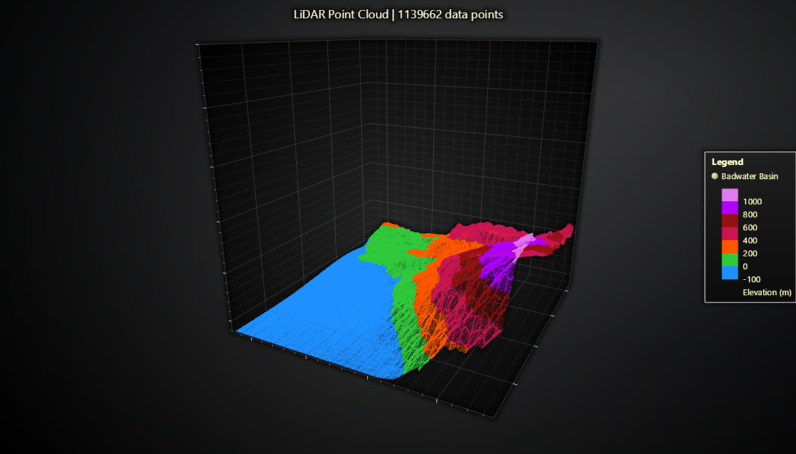

# 3D LiDAR Topography Visualization

This demo application belongs to the set of examples for LightningChart JS, data visualization library for JavaScript.

LightningChart JS is entirely GPU accelerated and performance optimized charting library for presenting massive amounts of data. It offers an easy way of creating sophisticated and interactive charts and adding them to your website or web application.

The demo can be used as an example or a seed project. Local execution requires the following steps:

-   Make sure that relevant version of [Node.js](https://nodejs.org/en/download/) is installed
-   Open the project folder in a terminal:

          npm install              # fetches dependencies
          npm start                # builds an application and starts the development server

-   The application is available at _http://localhost:8080_ in your browser, webpack-dev-server provides hot reload functionality.

## Description

This example shows visualization of a LiDAR scanned 3D object with LightningChart JS 3D Charts

This is LiDAR data of Badwater Basin in Death Valley National Park, Inyo County, California with 1.139.662 points

LightningChart JS is suitable for really fast visualization of LiDAR data sets in range of tens of millions samples, with 3D points or 3D surface. This example shows the approach with points. In this example, each point is coloured dynamically by their Y coordinate according to a value -> color lookup table.

Lidar data from: [Philipp Urech](https://sketchfab.com/3d-models/badwater-basin-30-sections-across-a-wash-ca8eebf6798d4b0a967336e16f066754) - Licensed under Creative Commons Attribute.

## API Links

* [3D chart]
* [3D axis]
* [3D Point Cloud Series]
* [3D Point Series Types]
* [3D Point Style]
* [Paletted Fill]

## Support

If you notice an error in the example code, please open an issue on [GitHub][0] repository of the entire example.

Official [API documentation][1] can be found on [LightningChart][2] website.

If the docs and other materials do not solve your problem as well as implementation help is needed, ask on [StackOverflow][3] (tagged lightningchart).

If you think you found a bug in the LightningChart JavaScript library, please contact sales@lightningchart.com.

Direct developer email support can be purchased through a [Support Plan][4] or by contacting sales@lightningchart.com.

[0]: https://github.com/Arction/
[1]: https://lightningchart.com/lightningchart-js-api-documentation/
[2]: https://lightningchart.com
[3]: https://stackoverflow.com/questions/tagged/lightningchart
[4]: https://lightningchart.com/support-services/

© LightningChart Ltd 2009-2022. All rights reserved.

[3D chart]: https://lightningchart.com/js-charts/api-documentation/v7.0.1/classes/Chart3D.html
[3D axis]: https://lightningchart.com/js-charts/api-documentation/v7.0.1/classes/Axis3D.html
[3D Point Cloud Series]: https://lightningchart.com/js-charts/api-documentation/v7.0.1/classes/PointCloudSeries3D.html
[3D Point Series Types]: https://lightningchart.com/js-charts/api-documentation/v7.0.1/variables/PointSeriesTypes3D-1.html
[3D Point Style]: https://lightningchart.com/js-charts/api-documentation/v7.0.1/variables/PointStyle3D.html
[Paletted Fill]: https://lightningchart.com/js-charts/api-documentation/v7.0.1/classes/PalettedFill.html

